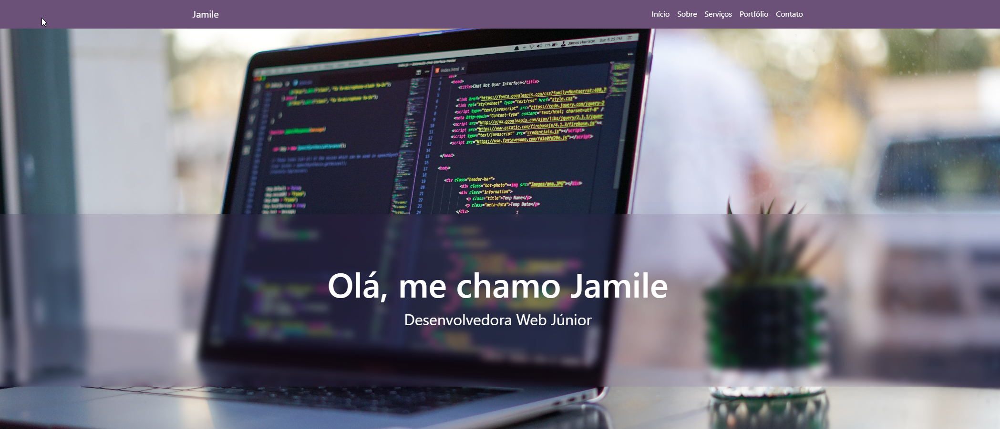

#PORTFÓLIO MAIS PRA TI

Criação de um portfólio no curso de desenvolvimento web Mais Pra Ti.

🎯 OBJETIVOS

Divulgação dos trabalhos desenvolvidos durante o curso.

💻 TECNOLOGIAS UTILIZADAS

- HTML
- CSS
- BOOTSTRAP

Na tela de início foi criado efeito com o glassmorfismo.

🎞 IMAGEM DO PROJETO

